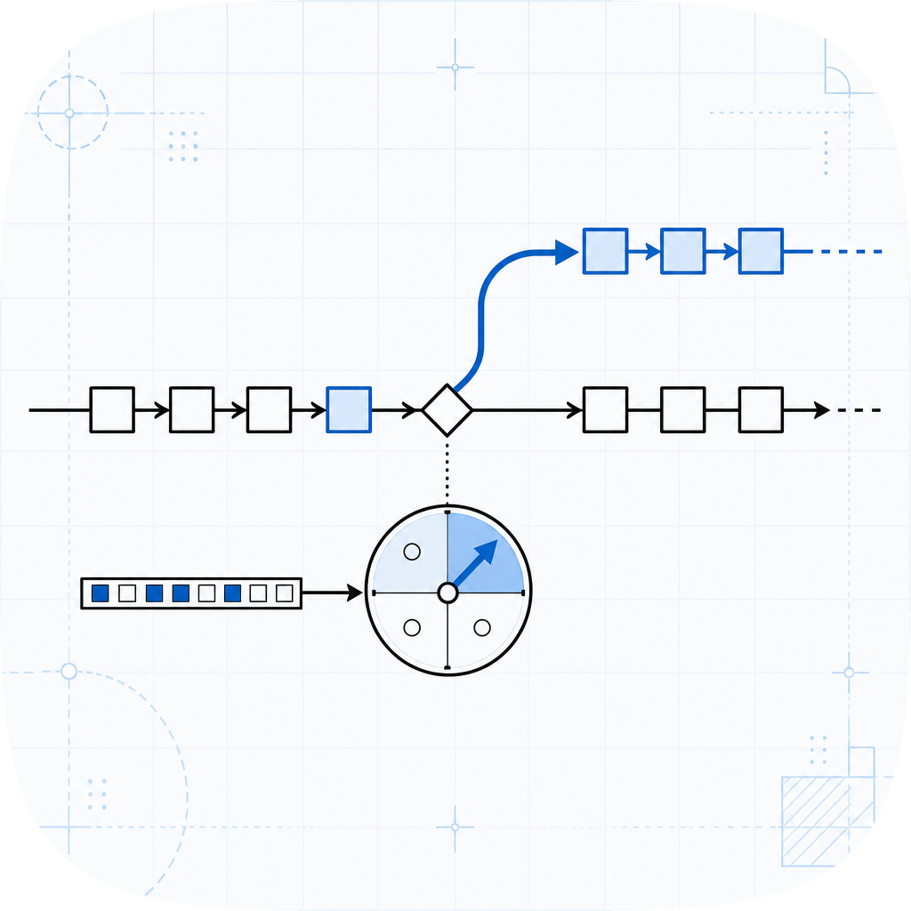

# bpred

<p align="center">
  
</p>

Pure-Python simulator of classical CPU branch predictors for computer architecture education.

Implements five predictors from first principles with zero runtime dependencies:

- **Bimodal** (Smith 1981) -- a table of n-bit saturating counters indexed by PC.
- **Gshare** (McFarling 1993) -- PC XOR global-history register indexes 2-bit counters.
- **Tournament** (McFarling 1993 / Alpha 21264) -- a meta-selector combining local and global sub-predictors.
- **Perceptron** (Jimenez and Lin 2001) -- a table of integer-weight perceptrons that can learn linearly-separable history patterns bimodal and gshare cannot capture.
- **Local-history / PAg** (Yeh and Patt 1991) -- a per-branch local history table feeds a shared pattern history table, learning periodic per-branch patterns that a bimodal predictor thrashes on.

Part of the same open-source computer architecture education series as [tomasulo](https://github.com/amaar-mc/tomasulo) (out-of-order execution) and scoreboarding.

## Install

```bash
pip install bpred
```

## Python API

```python
from bpred import BimodalPredictor, GsharePredictor, PerceptronPredictor, TournamentPredictor
from bpred import LocalHistoryPredictor
from bpred import run_trace, accuracy, mispredictions

# Bimodal: 2-bit counters, 1024-entry table
pred = BimodalPredictor(counter_bits=2, table_size=1024)

# Gshare: 10-bit history, 1024-entry table
pred = GsharePredictor(history_bits=10, table_size=1024)

# Tournament
from bpred import BimodalPredictor, GsharePredictor
local = BimodalPredictor(counter_bits=2, table_size=1024)
global_ = GsharePredictor(history_bits=10, table_size=1024)
pred = TournamentPredictor(local=local, global_=global_, meta_bits=2)

# Perceptron: 12-bit history, 1024-entry table
pred = PerceptronPredictor(history_length=12, table_size=1024)

# Local-history (PAg): 8-bit per-branch history, 1024-entry BHT, 256-entry PHT
pred = LocalHistoryPredictor(history_bits=8, bht_size=1024, pht_size=256)

# Feed a trace
trace = [(0x1000, True), (0x1004, False), (0x1008, True)]
result = run_trace(pred, trace=trace)
print(accuracy(trace_result=result))       # e.g. 0.6667
print(mispredictions(trace_result=result)) # e.g. 1
```

### Why use the perceptron predictor?

Bimodal and gshare each use a single scalar counter per table entry, so they
can only learn the *average* bias of a branch.  When the taken/not-taken
outcome correlates with a specific combination of recent history bits (a
linearly-separable pattern), those predictors plateau.

The perceptron predictor maintains a weight vector per entry.  The dot product
of those weights with the history vector expresses arbitrary linear functions
over H history bits.  This lets it learn, for example, "taken when the last
4 branches were all taken" or "taken on every other iteration" -- patterns
that require tracking distinct history bits simultaneously.  The trade-off is
that the predictor needs more warm-up branches to converge and the weights
grow without bound (in simulation; hardware clamps them to a fixed-point
range).

### Why use the local-history (PAg) predictor?

Bimodal predicts each branch from a single counter, so a branch whose outcome
follows a short repeating pattern -- the textbook `T, N, T, N, ...` of a loop
that runs an even number of times, for example -- makes the counter oscillate
and the predictor thrashes near 50%.

The local-history predictor (the PAg configuration of Yeh and Patt's two-level
adaptive scheme, 1991) gives every branch its own N-bit shift register of
recent outcomes in a branch history table (BHT).  That local pattern then
indexes a shared pattern history table (PHT) of 2-bit counters, so each
distinct recent-history pattern gets its own counter.  A period-k pattern is
learned to near-100% accuracy once `history_bits >= k`, because each phase of
the period maps to a different PHT entry.  The first level is per-address
(`P`), the training is adaptive (`A`), and the second-level PHT is global
(`g`), which is what the name PAg encodes.  The per-address-PHT variant (PAp)
is a natural extension left as future work.

## CLI

```
bpred bimodal --counter-bits 2 --table-size 1024 path/to/trace.trace
bpred gshare --history-bits 10 --table-size 1024 path/to/trace.trace
bpred local --history-bits 8 --bht-size 1024 --pht-size 256 path/to/trace.trace
bpred tournament \
  --local-predictor bimodal --local-counter-bits 2 --local-table-size 1024 \
  --global-predictor gshare --global-history-bits 10 --global-table-size 1024 \
  --meta-bits 2 \
  path/to/trace.trace
```

Trace file format -- one branch per line:

```
# pc taken
0x1000 1
0x1004 0
0x1008 T
0x100c false
```

## Accuracy example

Running the bundled sample trace with a gshare predictor:

```
$ bpred gshare --history-bits 4 --table-size 16 examples/sample.trace
Predictor : GsharePredictor(history_bits=4, table_size=16)
Branches  : 20
Hits      : 18
Misses    : 2
Accuracy  : 90.0000%
```

## Development

```bash
pip install -e ".[dev]"
pytest -q
ruff check .
mypy src
```

## License

MIT. See [LICENSE](LICENSE).
